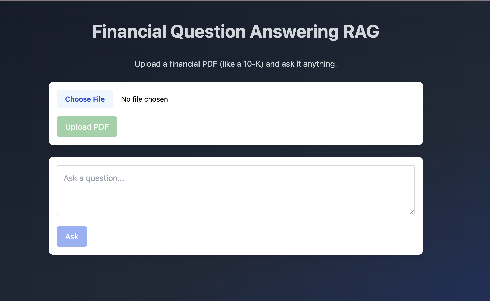

# FinQ-RAG

**FinQ-RAG** is a local, lightweight Retrieval-Augmented Generation (RAG) system for querying financial PDFs (like 10-Ks). Users can upload a document and ask natural language questions — the system retrieves relevant chunks using semantic search and answers using a small LLM (like Flan-T5).

Built with:
- `sentence-transformers` + `FAISS` for local dense retrieval
- `Flan-T5` via Hugging Face `transformers` for answer generation
- FastAPI backend
- Angular + Tailwind CSS frontend

---

## Features

- Upload financial PDFs like 10-Ks or earnings reports
- Local semantic chunk retrieval with `all-MiniLM-L6-v2`
- Ask any question — “What are the company’s risk factors?”
- Answers generated with Flan-T5 (`google/flan-t5-base`)
- Fully styled with TailwindCSS (dark blue gradient, spinner, and prose output)
- Works entirely on your local machine (no external APIs needed)

---

## Demo Screenshot




https://github.com/user-attachments/assets/76f9f5d1-9a45-4031-b817-f1230bc77383


---

## Installation

### 1. Backend Setup

```bash
cd backend
python3 -m venv venv
source venv/bin/activate
pip install -r requirements.txt
uvicorn main:app --reload
```

> Access backend docs at: http://localhost:8000/docs

---

### 2. Frontend Setup

```bash
cd frontend-angular
npm install
ng serve
```

> App runs at: http://localhost:4200

---

## Usage

1. Upload a PDF (e.g., Apple’s 10-K)
2. Ask natural questions like:
   - “What were Apple’s total revenues in 2023?”
   - “What are the company’s key risks?”
3. Get a fluent answer with referenced content

---

## Backend Dependencies

- [`sentence-transformers`](https://www.sbert.net/)
- [`faiss`](https://github.com/facebookresearch/faiss)
- [`transformers`](https://huggingface.co/docs/transformers/)
- [`PyMuPDF`](https://pymupdf.readthedocs.io/en/latest/)

---

## Example Prompt

```
Context: [retrieved paragraphs from PDF]

Question: What are the risks mentioned?

Answer: ...
```

---

##  Author

Built by [Jatin Kulkarni](https://www.linkedin.com/in/jatinkulkarni/) — Cornell Tech M.Eng | ML & AI Engineer
